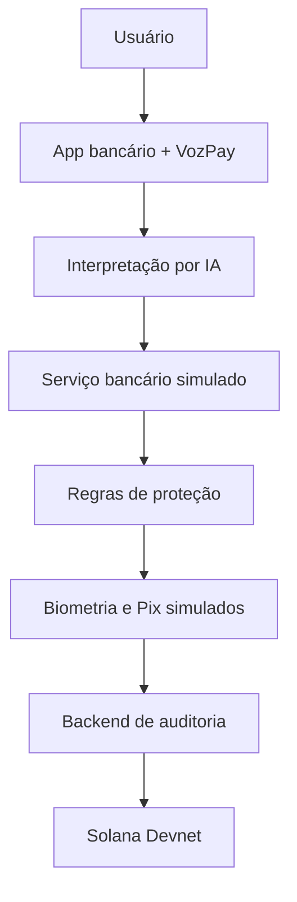

# VozPay


> Acessibilidade que ajuda o usuário a pedir, entender, conferir e autorizar pagamentos.

O VozPay é uma camada B2B white-label incorporada ao aplicativo de uma instituição financeira. Seu objetivo é tornar pagamentos digitais mais compreensíveis e seguros por meio de voz, texto, botões acessíveis, linguagem simples e proteção proporcional ao risco.

O banco continua responsável por identidade, autenticação, antifraude e execução do Pix. A IA interpreta a solicitação, enquanto a Solana registra uma prova independente das etapas de proteção.

## Problema

Pessoas idosas ou com baixa familiaridade digital podem depender de terceiros para realizar pagamentos. As principais barreiras são:

- receio de transferir para a pessoa errada;
- dificuldade para entender termos bancários;
- interfaces que mudam com frequência;
- pouca clareza sobre destinatário, valor e conclusão;
- exposição a golpes por ligação e aplicativos de mensagem.

O público inicial do MVP são pessoas com 60 anos ou mais. A solução pode ser expandida para pessoas com deficiência visual, dificuldade de leitura, baixa alfabetização digital ou qualquer cliente que prefira uma experiência financeira mais compreensível.

## Solução

O VozPay funciona como um modo de acessibilidade ativado voluntariamente dentro do aplicativo bancário.

1. O usuário fala ou digita o pedido.
2. A IA extrai somente intenção, valor e destinatário informado.
3. O banco simulado resolve o contato e retorna os dados oficiais.
4. O VozPay apresenta nome, instituição e valor em linguagem simples.
5. As políticas identificam novo destinatário, valor elevado ou sinais de engenharia social.
6. O usuário revisa e confirma com biometria simulada.
7. O banco simula a execução do Pix.
8. O backend registra uma prova criptográfica na Solana Devnet.
9. O comprovante exibe o identificador e o link verificável.

## Responsabilidades

| Componente | Responsabilidade |
|---|---|
| VozPay | Interface acessível, explicações e regras de proteção |
| Serviço de IA | Interpretar a solicitação e retornar dados estruturados |
| Banco Uno | Simular cadastro, consulta Pix, biometria e execução |
| Backend VozPay | Proteger credenciais e criar o evento de auditoria |
| Solana Devnet | Registrar a prova criptográfica verificável |

A IA não inventa chaves, não autentica o cliente e não executa a transferência. A voz também não é utilizada como fator único de autenticação.

## Arquitetura



Em uma implementação real, a interpretação por IA e a assinatura Solana devem ocorrer no backend autenticado da instituição financeira.

## Papel da Solana

A Solana não substitui nem executa o Pix. Ela registra uma prova de que as etapas de proteção foram realizadas.

O backend monta um evento mínimo:

```json
{
  "policyVersion": "1.0",
  "event": "additional_confirmation_completed",
  "timestamp": "gerado pelo servidor",
  "sessionId": "identificador aleatório"
}
```

Esse conteúdo é convertido em SHA-256. Somente o hash, a versão e a identificação técnica do produto são enviados pelo Memo Program. Não são publicados:

- nome ou documento;
- chave Pix;
- telefone ou e-mail;
- valor e saldo;
- instituição bancária;
- áudio ou biometria;
- chave privada.

## Cenários do MVP

### Pagamento cotidiano

> “Mande 150 reais para minha filha.”

O cadastro local associa “minha filha” a Maria Silva. O aplicativo apresenta os dados, solicita biometria simulada, conclui o Pix fictício e registra a proteção.

### Operação de maior atenção

> “Mande 2 mil reais para João.”

O aplicativo identifica valor acima do limite e novo destinatário, explica os motivos, pergunta se alguém orientou o pagamento por ligação ou mensagem e permite revisar, cancelar ou prosseguir com biometria adicional.

## Estado atual

| Recurso | Estado |
|---|---|
| Interface Flutter integrada ao Banco Uno | Funcional |
| Entrada por voz | Funcional, pendente de validação em diferentes dispositivos |
| Entrada por texto | Funcional |
| Interpretação por IA | Funcional quando configurada |
| Apelido “minha filha” | Demonstração local |
| Alerta por valor e destinatário | Funcional |
| Biometria | Simulada |
| Consulta e execução do Pix | Simuladas |
| Registro Solana Devnet | Implementado, depende de carteira financiada e backend |
| Cadastro visual de contatos | Planejado |
| Digitação específica de chave Pix | Planejada |
| Leitura de QR Code | Planejada |
| Pessoa de apoio | Planejada e opcional |

## Tecnologias

- Flutter e Dart;
- reconhecimento de voz e síntese de fala;
- serviço de IA generativa;
- Node.js e Express;
- SHA-256;
- Solana Web3.js;
- Solana Devnet e Memo Program.

## Estrutura

```text
vozpay/
├── mobile/                   # Aplicativo Flutter
│   ├── lib/main.dart
│   ├── lib/services/
│   ├── .env.example
│   └── README.md
├── backend/                  # Auditoria Solana
│   ├── server.js
│   ├── package.json
│   ├── .env.example
│   └── README.md
├── docs/
│   └── MVP.md
├── index.html                # Protótipo web inicial
├── styles.css
└── app.js
```

## Pré-requisitos

- Flutter compatível com Dart 3.4 ou superior;
- Google Chrome ou dispositivo Android;
- Node.js 20 ou superior;
- chave do serviço de IA;
- carteira exclusiva para Solana Devnet;
- SOL de teste para pagar as taxas da Devnet.

## Executar o backend

Na raiz do repositório:

```powershell
cd backend
Copy-Item .env.example .env
npm install
```

Preencha `backend/.env`:

```env
PORT=3000
SOLANA_NETWORK=devnet
SOLANA_RPC_URL=https://api.devnet.solana.com
SOLANA_PRIVATE_KEY=[ARRAY_JSON_COM_64_NUMEROS]
```

A carteira deve ser criada exclusivamente para a demonstração e financiada com SOL da Devnet. Nunca utilize uma carteira pessoal ou com fundos reais.

Inicie o serviço:

```powershell
npm start
```

Valide em:

```text
http://localhost:3000/health
```

Resposta esperada:

```json
{"status":"ok","network":"devnet"}
```

## Executar o Flutter

Em outro terminal, na raiz do repositório:

```powershell
cd mobile
Copy-Item .env.example .env
```

Preencha `mobile/.env`:

```env
GEMINI_API_KEY=SUA_CHAVE
GEMINI_MODEL=gemini-2.5-flash
AUDIT_API_URL=http://localhost:3000
```

Execute:

```powershell
flutter pub get
flutter run -d chrome
```

Para emulador Android, substitua a URL por:

```env
AUDIT_API_URL=http://10.0.2.2:3000
```

Para celular físico, utilize o IP local do computador e mantenha os dois dispositivos na mesma rede:

```env
AUDIT_API_URL=http://192.168.X.X:3000
```

Se aparecer `No pubspec.yaml file found`, confirme que o terminal está dentro da pasta `mobile`.

## Gerar o APK

Dentro da pasta `mobile`:

```powershell
flutter clean
flutter pub get
flutter build apk --release
```

Arquivo gerado:

```text
mobile/build/app/outputs/flutter-apk/app-release.apk
```

O APK compila as configurações do `.env`. Para uma distribuição pública, a chave da IA deve sair do aplicativo e ser armazenada no backend.

## Gerar a versão web

```powershell
cd mobile
flutter build web --release
```

Resultado:

```text
mobile/build/web/
```

## Teste de aceite

Antes da entrega, verificar:

- [ ] o microfone inicia e sempre pode ser encerrado;
- [ ] o pedido digitado percorre o mesmo fluxo da voz;
- [ ] o nome do fornecedor da IA não aparece para o cliente;
- [ ] pedidos sem valor ou destinatário não avançam;
- [ ] os dois cenários funcionam do início ao comprovante;
- [ ] o backend responde em `/health`;
- [ ] o comprovante mostra uma transação real da Devnet;
- [ ] o link abre corretamente no Solana Explorer;
- [ ] nenhum segredo foi enviado ao GitHub;
- [ ] o APK abre em outro dispositivo;
- [ ] o vídeo demonstra o fluxo em até três minutos.

## Limitações

Este é um MVP acadêmico. Pix, biometria, consulta bancária e antifraude são simulados. O registro de auditoria pode ser real na Devnet, mas os tokens utilizados não possuem valor financeiro. O projeto não está pronto para movimentar dinheiro real.

## Entrega

A entrega final deve conter:

- repositório público;
- APK Android;
- link da versão web;
- vídeo demonstrativo;
- apresentação;
- comprovante de uma transação na Solana Devnet.

Os links de APK, aplicação, vídeo e apresentação devem ser adicionados aqui quando forem publicados.

## Equipe

Os nomes e RMs de todos os integrantes devem ser inseridos aqui antes da entrega. Nenhum integrante foi presumido para evitar informação incorreta.

## Documentação complementar

- [Plano, decisões e critérios do MVP](docs/MVP.md)
- [Execução do Flutter](mobile/README.md)
- [Backend de auditoria Solana](backend/README.md)

## Segurança

- não versionar arquivos `.env`;
- não publicar chaves privadas;
- não utilizar carteira da Mainnet;
- restringir CORS e autenticar o backend antes de qualquer uso público;
- limitar requisições e monitorar custos;
- não enviar dados pessoais ou financeiros para a blockchain;
- rotacionar as credenciais utilizadas na demonstração.
